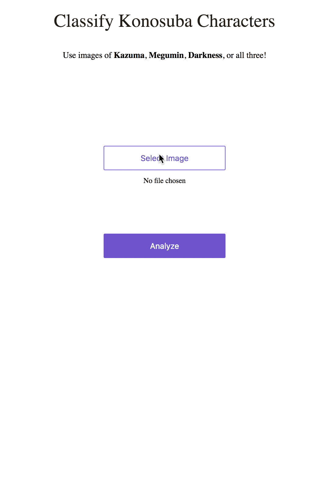

# Starter for deploying [fast.ai](https://www.fast.ai) models on [Render](https://render.com)

This repo can be used as a starting point to deploy [fast.ai](https://github.com/fastai/fastai) models on Render.

The sample app described here is up at https://fastai-v3.onrender.com. Test it out with bear images!

You can test your changes locally by installing Docker and using the following command:

```
docker build -t fastai-v3 . && docker run --rm -it -p 5000:5000 fastai-v3
```

The guide for production deployment to Render is at https://course.fast.ai/deployment_render.html.

Please use [Render's fast.ai forum thread](https://forums.fast.ai/t/deployment-platform-render/33953) for questions and support.

---

# Try out my [Konosuba Character Classifier](https://konosuba-render.onrender.com)

* Not sure how long the site will be live for.
* A quick demo is shown below.


